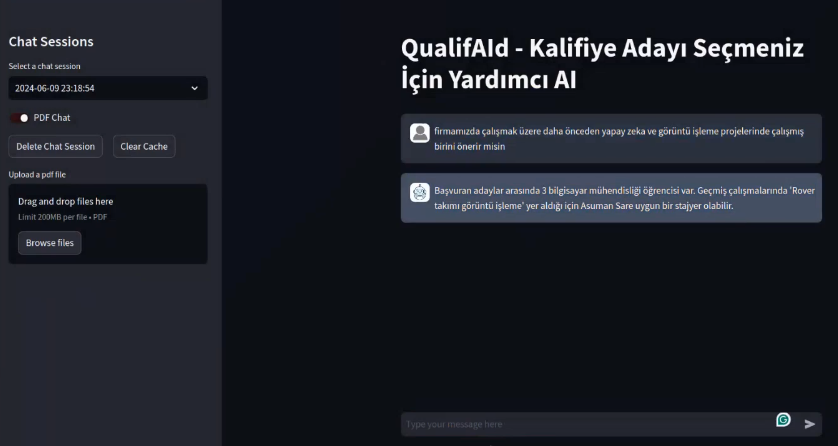

  <h2>
    QualifAId: RAG-Powered AI Recruiter 🤖📄
  </h2>
  

    
  

  

    <a target="_blank" href="https://youtu.be/TIslxKww8so">
      🎥 Watch Demo Video
    </a>
  

---

## 🌟 Project Description

**QualifAId** is an AI-powered recruitment assistant that evaluates and ranks CVs using **Retrieval-Augmented Generation (RAG)**. Upload a pool of resumes, define your hiring criteria, and **interact with the AI** to discover top candidates based on real skill evidence — not just keyword matches.

🔍 Say goodbye to endless filtering — just **chat** with the system and get **personalized candidate recommendations**.

📄 **Project Report Preview**  
You can explore the full technical documentation directly here:

📘 <code>doc/QualifAId.pdf</code> Preview

[📂 Click to open in GitHub](doc/QualifAId.pdf)

---

## 🚀 Key Features

- RAG-based document retrieval from CVs
- Chat interface powered by LLMs
- Evaluates actual skill match from resume content
- No keyword dependency, context-aware understanding

---
